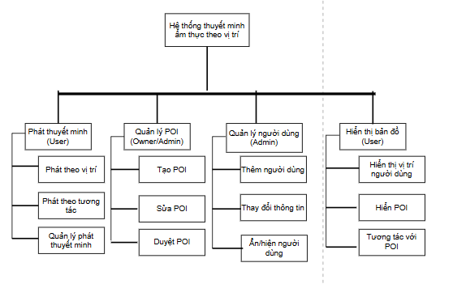
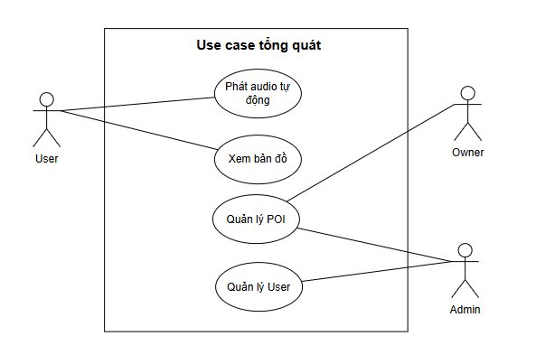
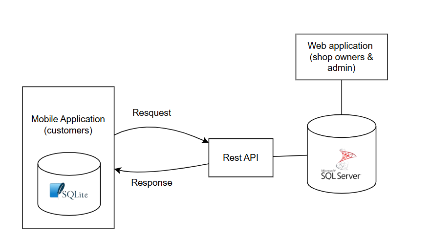
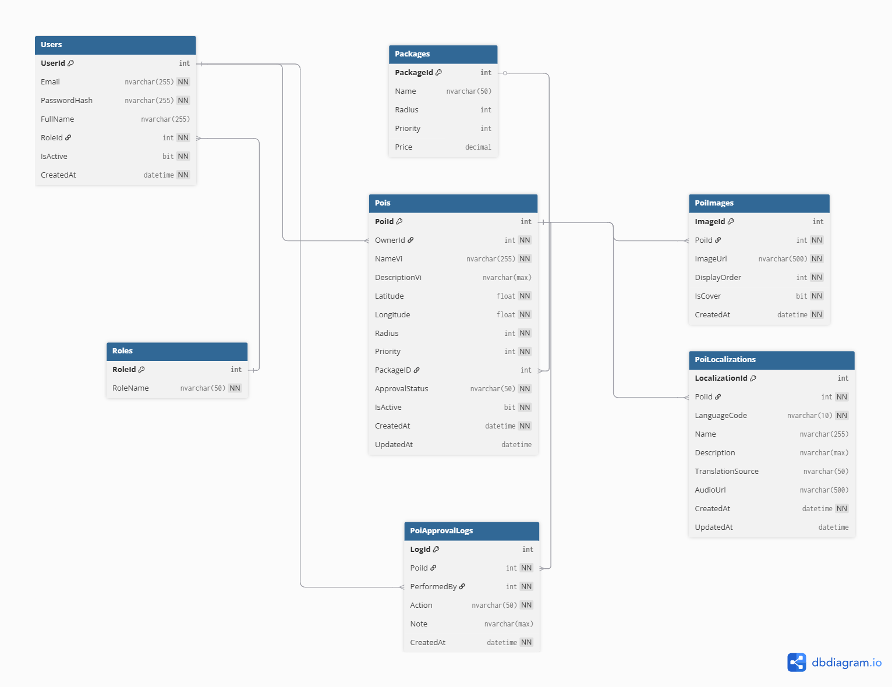
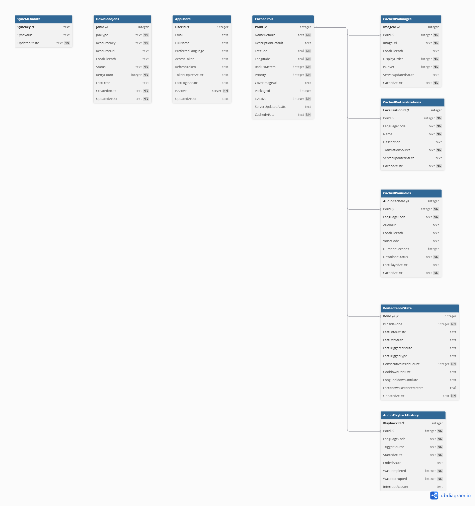
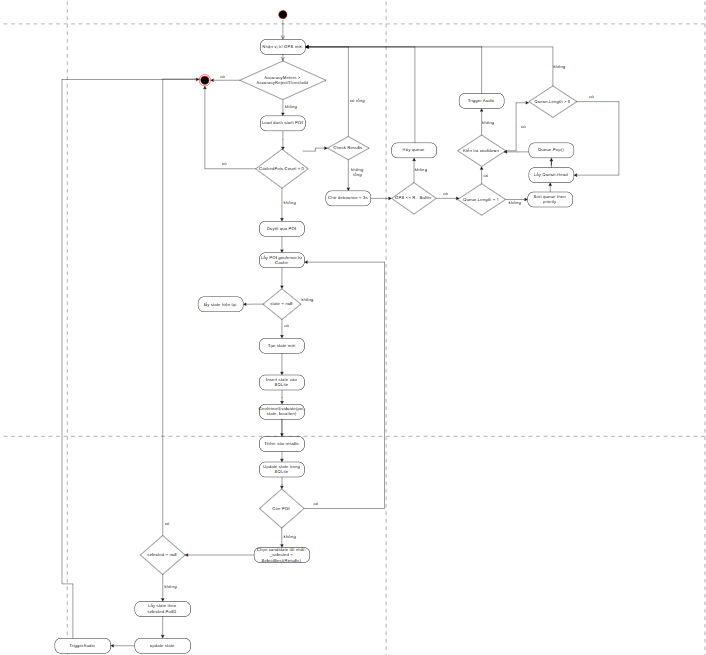
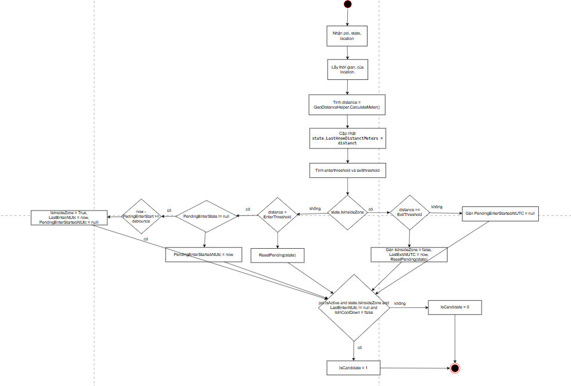
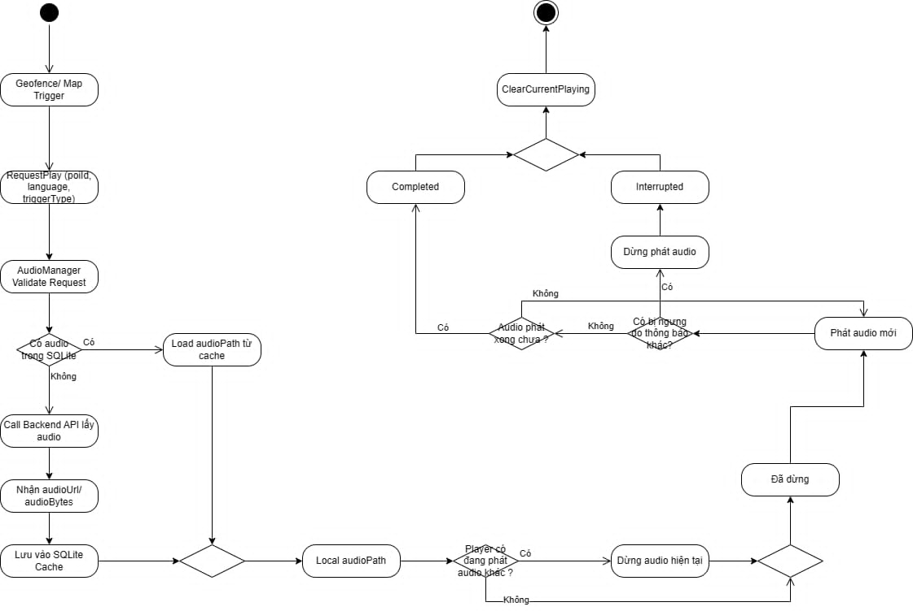
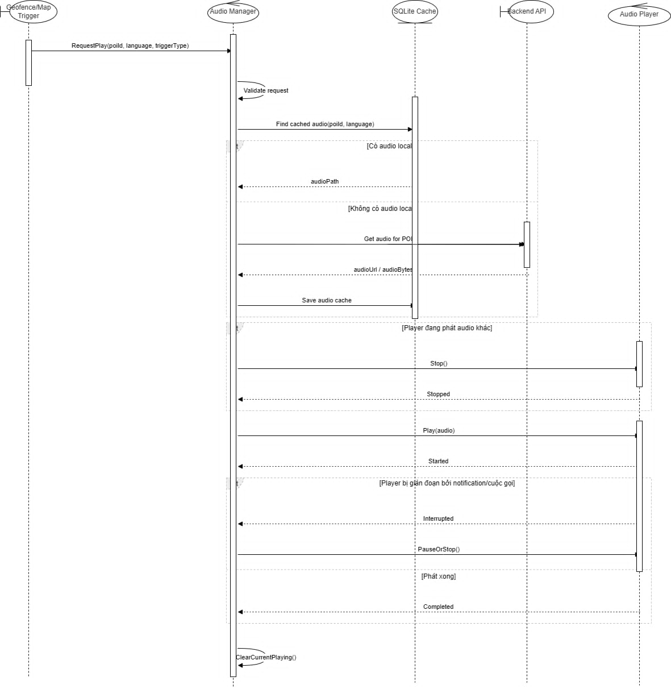
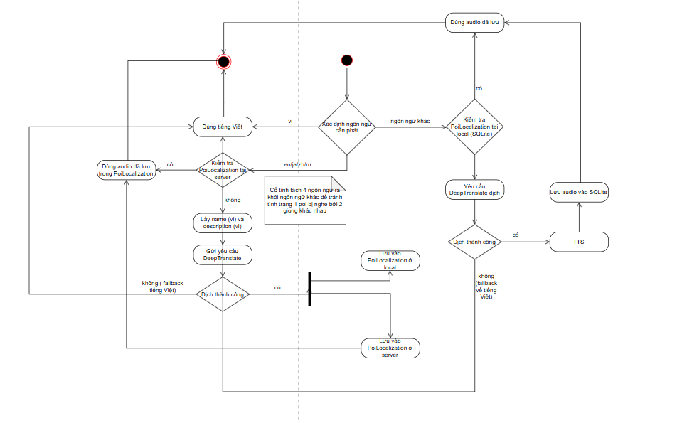

# ỨNG DỤNG THUYẾT MINH PHỐ ẨM THỰC VĨNH KHÁNH (QUẬN 4)

Ứng dụng di động hỗ trợ thuyết minh tự động theo vị trí GPS tại phố ẩm thực Vĩnh Khánh (Quận 4). Hệ thống sử dụng geofence để phát nội dung audio khi người dùng đi vào vùng của các điểm quan tâm (POI), đồng thời hỗ trợ đa ngôn ngữ, cache offline và cơ chế chống spam khi kích hoạt audio.

## Mục Lục

- [Tổng Quan](#tổng-quan)
- [Vai Trò Người Dùng](#vai-trò-người-dùng)
- [Phạm Vi Hệ Thống](#phạm-vi-hệ-thống)
- [Tính Năng Chính](#tính-năng-chính)
- [Thiết Kế Dữ Liệu](#thiết-kế-dữ-liệu)
- [Luồng Geofence](#luồng-geofence)
- [Luồng Geofence To Audio](#luồng-geofence-to-audio)
- [DeepTranslate Và Chiến Lược Lưu Ngôn Ngữ](#deeptranslate-và-chiến-lược-lưu-ngôn-ngữ)
- [Danh Sách API](#danh-sách-api)
- [Công Nghệ Sử Dụng](#công-nghệ-sử-dụng)

## Tổng Quan

Hệ thống là một mobile app giúp khách du lịch tiếp cận thông tin cửa hàng qua audio theo vị trí hiện tại. Khi người dùng đi vào vùng geofence của một POI, ứng dụng sẽ tự động kích hoạt nội dung phù hợp theo ngôn ngữ thiết bị hoặc ngôn ngữ được yêu cầu.

### Mục tiêu sản phẩm

- Tăng trải nghiệm khám phá ẩm thực bằng audio thuyết minh tự động
- Cung cấp thông tin theo ngữ cảnh vị trí thực tế của người dùng
- Hỗ trợ đa ngôn ngữ và khả năng hoạt động online/offline
- Cho phép owner quản lý nội dung POI và admin kiểm duyệt tập trung

### Sơ đồ nghiệp vụ

## Vai Trò Người Dùng

| Vai trò | Mô tả |
| --- | --- |
| `User` | Khách du lịch sử dụng app để xem POI và nghe audio thuyết minh |
| `Owner` | Chủ quán tạo, cập nhật và gửi POI để chờ duyệt |
| `Admin` | Quản trị hệ thống, duyệt hoặc từ chối POI trước khi public |

## Phạm Vi Hệ Thống

### Mobile App

- Theo dõi GPS khi ứng dụng đang ở foreground
- Hiển thị vị trí hiện tại của người dùng trên bản đồ
- Hiển thị các POI đang active trên bản đồ
- Tự động phát audio khi người dùng đi vào vùng geofence của POI
- Cho phép bấm vào POI để xem chi tiết và phát audio thủ công
- Hỗ trợ online và offline
- Sử dụng SQLite để cache POI, localization, audio và trạng thái runtime khi cần

### Geofence Và Anti-Spam

- Lấy vị trí bằng Fused Location Provider
- Tính khoảng cách giữa user và POI
- Trigger theo bán kính `R` của từng POI
- Chống spam bằng các cơ chế:
- Accuracy filter
- Xác nhận qua nhiều lần cập nhật liên tiếp
- Buffer zone
- Debounce
- Short cooldown
- Long cooldown

### Audio Thuyết Minh

- Mỗi POI có nội dung giới thiệu
- Audio phát theo ngôn ngữ điện thoại hoặc ngôn ngữ yêu cầu
- Không phát trùng lặp
- Có cơ chế dừng audio cũ để phát audio mới
- Có quản lý queue và xử lý collision khi nhiều POI ở gần nhau

### Gói Dịch Vụ

| Gói | Bán kính kích hoạt | Priority |
| --- | --- | --- |
| Cơ bản | `15m` | `0` |
| Nâng cao | `30m` | `1` |
| Chuyên nghiệp | `50m` | `2` |

### Text-To-Speech Và Localization

- POI gốc được lưu bằng tiếng Việt
- 4 ngôn ngữ mặc định gồm tiếng Anh, tiếng Trung, tiếng Nhật và tiếng Nga
- Có thể dịch thêm các ngôn ngữ khác theo nhu cầu thiết bị
- Localization được lưu trên server và cache xuống app khi cần

### Quản Lý POI

- Owner tạo POI
- Owner sửa, xóa và cập nhật POI
- Owner upload ảnh và nhập nội dung mô tả
- Owner submit POI để chờ duyệt
- Admin duyệt hoặc từ chối POI
- Chỉ các POI đã `approved` và `active` mới được public cho user

## Tính Năng Chính

| Feature | Mô tả |
| --- | --- |
| `Audio` | Phát audio thuyết minh và phối hợp với luồng dịch nội dung |
| `Auth` | Đăng nhập, xác thực bằng JWT token và phân quyền theo role |
| `Map` | Hiển thị vị trí hiện tại, POI đang active, hỗ trợ map online và offline |
| `POI` | Quản lý vòng đời POI: tạo, sửa, xóa, submit, duyệt |
| `Localization` | Cache POI, localization, audio, geofence state và playback history trong SQLite |

## Thiết Kế Dữ Liệu

### Data Pipeline

### SQL Server Schema

#### Users

| Tên cột | Kiểu dữ liệu | Mô tả nghiệp vụ |
| --- | --- | --- |
| UserId | int (PK) | Định danh người dùng |
| Email | nvarchar(255) UNIQUE | Email đăng nhập |
| PasswordHash | nvarchar(255) | Mật khẩu đã hash |
| FullName | nvarchar(255) | Tên hiển thị |
| RoleId | int (FK Roles) | Vai trò người dùng |
| IsActive | bit | Trạng thái hoạt động |
| CreatedAt | datetime | Thời điểm tạo |

#### Roles

| Tên cột | Kiểu dữ liệu | Mô tả nghiệp vụ |
| --- | --- | --- |
| RoleId | int (PK) | Định danh role |
| RoleName | nvarchar(50) UNIQUE | Tên role |

#### Packages

| Tên cột | Kiểu dữ liệu | Mô tả nghiệp vụ |
| --- | --- | --- |
| PackageId | int (PK) | Định danh package |
| Name | nvarchar(50) | Tên gói |
| Radius | int | Bán kính kích hoạt |
| Priority | int | Độ ưu tiên |
| Price | decimal | Giá tiền |

#### Pois

| Tên cột | Kiểu dữ liệu | Mô tả nghiệp vụ |
| --- | --- | --- |
| PoiId | int (PK) | Định danh POI |
| OwnerId | int (FK Users) | Chủ sở hữu |
| NameVi | nvarchar(255) | Tên tiếng Việt |
| DescriptionVi | nvarchar(max) | Mô tả |
| Latitude | float | Vĩ độ |
| Longitude | float | Kinh độ |
| Radius | int | Bán kính |
| Priority | int | Độ ưu tiên |
| PackageID | int (FK Packages) | Gói dịch vụ |
| ApprovalStatus | nvarchar(50) | Trạng thái duyệt |
| IsActive | bit | Trạng thái hoạt động |
| CreatedAt | datetime | Ngày tạo |
| UpdatedAt | datetime | Ngày cập nhật |

#### PoiImages

| Tên cột | Kiểu dữ liệu | Mô tả nghiệp vụ |
| --- | --- | --- |
| ImageId | int (PK) | Định danh ảnh |
| PoiId | int (FK Pois) | Thuộc POI |
| ImageUrl | nvarchar(500) | Link ảnh |
| DisplayOrder | int | Thứ tự hiển thị |
| IsCover | bit | Ảnh đại diện |
| CreatedAt | datetime | Ngày tạo |

#### PoiLocalizations

| Tên cột | Kiểu dữ liệu | Mô tả nghiệp vụ |
| --- | --- | --- |
| LocalizationId | int (PK) | Định danh localization |
| PoiId | int (FK Pois) | Thuộc POI |
| LanguageCode | nvarchar(10) | Mã ngôn ngữ |
| Name | nvarchar(255) | Tên đã dịch |
| Description | nvarchar(max) | Mô tả đã dịch |
| TranslationSource | nvarchar(50) | Nguồn dịch |
| AudioUrl | nvarchar(500) | Link audio |
| CreatedAt | datetime | Ngày tạo |
| UpdatedAt | datetime | Ngày cập nhật |

#### PoiApprovalLogs

| Tên cột | Kiểu dữ liệu | Mô tả nghiệp vụ |
| --- | --- | --- |
| LogId | int (PK) | Định danh log |
| PoiId | int (FK Pois) | POI liên quan |
| PerformedBy | int (FK Users) | Người thực hiện |
| Action | nvarchar(50) | Hành động |
| Note | nvarchar(max) | Ghi chú |
| CreatedAt | datetime | Ngày tạo |

### Cache Database (SQLite)

#### AppUsers

Lưu thông tin người dùng hiện tại trên thiết bị mobile.

| Tên cột | Kiểu dữ liệu | Khóa | Mô tả |
| --- | --- | --- | --- |
| UserId | integer | PK | ID người dùng |
| Email | text |  | Email đăng nhập |
| FullName | text |  | Tên hiển thị |
| PreferredLanguage | text |  | Ngôn ngữ ưu tiên |
| AccessToken | text |  | Token truy cập API |
| RefreshToken | text |  | Token làm mới |
| TokenExpiresAtUtc | text |  | Thời gian hết hạn token |
| LastLoginAtUtc | text |  | Lần đăng nhập gần nhất |
| IsActive | integer |  | Trạng thái user |
| UpdatedAtUtc | text |  | Thời điểm cập nhật |

#### CachedPois

Cache danh sách POI phục vụ map và geofence.

| Tên cột | Kiểu dữ liệu | Khóa | Mô tả |
| --- | --- | --- | --- |
| PoiId | integer | PK | ID POI |
| NameDefault | text |  | Tên mặc định |
| DescriptionDefault | text |  | Mô tả mặc định |
| Latitude | real |  | Vĩ độ |
| Longitude | real |  | Kinh độ |
| RadiusMeters | integer |  | Bán kính |
| Priority | integer |  | Độ ưu tiên |
| CoverImageUrl | text |  | Ảnh đại diện |
| PackageId | integer |  | Gói dịch vụ |
| IsActive | integer |  | Trạng thái active |
| ServerUpdatedAtUtc | text |  | Cập nhật từ server |
| CachedAtUtc | text |  | Thời điểm cache |

#### CachedPoiImages

Cache ảnh của POI.

| Tên cột | Kiểu dữ liệu | Khóa | Mô tả |
| --- | --- | --- | --- |
| ImageId | integer | PK | ID ảnh |
| PoiId | integer | FK | Thuộc POI |
| ImageUrl | text |  | URL ảnh |
| LocalFilePath | text |  | Đường dẫn local |
| DisplayOrder | integer |  | Thứ tự hiển thị |
| IsCover | integer |  | Ảnh đại diện |
| ServerUpdatedAtUtc | text |  | Cập nhật server |
| CachedAtUtc | text |  | Thời điểm cache |

#### CachedPoiLocalizations

Cache nội dung đa ngôn ngữ.

| Tên cột | Kiểu dữ liệu | Khóa | Mô tả |
| --- | --- | --- | --- |
| LocalizationId | integer | PK | ID localization |
| PoiId | integer | FK | Thuộc POI |
| LanguageCode | text |  | Mã ngôn ngữ |
| Name | text |  | Tên đã dịch |
| Description | text |  | Mô tả đã dịch |
| TranslationSource | text |  | Nguồn dịch |
| ServerUpdatedAtUtc | text |  | Cập nhật server |
| CachedAtUtc | text |  | Thời điểm cache |
| AudioPath | text | | Filepath đến Audio lưu tại local |

#### PoiGeofenceState

Trạng thái geofence runtime.

| Tên cột | Kiểu dữ liệu | Khóa | Mô tả |
| --- | --- | --- | --- |
| PoiId | integer | PK, FK | POI |
| IsInsideZone | integer |  | Trong vùng hay không |
| LastEnterAtUtc | text |  | Lần vào vùng |
| LastExitAtUtc | text |  | Lần ra vùng |
| LastTriggeredAtUtc | text |  | Lần trigger audio |
| LastTriggerType | text |  | Loại trigger |
| ConsecutiveInsideCount | integer |  | Số lần xác nhận |
| CooldownUntilUtc | text |  | Short cooldown |
| LongCooldownUntilUtc | text |  | Long cooldown |
| LastKnownDistanceMeters | real |  | Khoảng cách gần nhất |
| UpdatedAtUtc | text |  | Cập nhật |

#### AudioPlaybackHistory

Lịch sử phát audio.

| Tên cột | Kiểu dữ liệu | Khóa | Mô tả |
| --- | --- | --- | --- |
| PlaybackId | integer | PK | ID playback |
| PoiId | integer | FK | POI |
| LanguageCode | text |  | Ngôn ngữ |
| TriggerSource | text |  | Nguồn phát |
| StartedAtUtc | text |  | Bắt đầu |
| EndedAtUtc | text |  | Kết thúc |
| WasCompleted | integer |  | Phát hết hay không |
| WasInterrupted | integer |  | Bị ngắt hay không |

## Luồng Geofence

### Nguyên tắc hoạt động

- Ứng dụng chỉ theo dõi GPS khi người dùng đang bật ứng dụng
- Sử dụng Fused Location để nhận vị trí
- Khi người dùng đứng yên, lấy GPS mỗi `5s`
- Khi người dùng di chuyển, lấy GPS mỗi `3s`

### Chống Nhiễu

Hệ thống sử dụng `buffer zone = 1m` để giảm ảnh hưởng của sai số GPS tại vùng biên geofence. Với mỗi POI có bán kính kích hoạt `R`:

- Ngưỡng xác nhận vào vùng: `R - 1m`
- Ngưỡng xác nhận ra khỏi vùng: `R + 1m`

Cơ chế này giúp tránh việc GPS dao động quanh biên khiến hệ thống hiểu sai rằng người dùng đang liên tục ra vào vùng kích hoạt.

Ngoài ra hệ thống còn sử dụng:

- `Debounce = 3s` để xác nhận vào vùng thật
- `Short cooldown = 45s` để ngăn kích hoạt lặp do sai số GPS
- `Long cooldown = 15 phút` để tránh nghe lại cùng một POI trong thời gian ngắn

### Activity Diagram

### Luồng Xử Lý

#### Giai đoạn 1: Nhận GPS

- App nhận vị trí mới từ Fused Location
- Cập nhật vị trí người dùng trên map
- Bỏ qua location có `accuracy` quá thấp

#### Giai đoạn 2: Kiểm tra trạng thái vùng của từng POI

- Tính khoảng cách user - POI
- Không dùng duy nhất một ngưỡng `<= R`
- Áp dụng hysteresis:
- `Enter threshold = R - 1m`
- `Exit threshold = R + 1m`
- Nếu đang outside và `distance <= R - 1m` thì đưa vào `pending enter`
- Nếu đang inside và `distance >= R + 1m` thì xác nhận `exit zone`

#### Giai đoạn 3: Debounce xác nhận enter

- Chờ `3 giây` để xác nhận user thật sự đã vào vùng
- Chỉ khi hết debounce và vẫn thỏa điều kiện inside mới chuyển sang bước xét phát

#### Giai đoạn 4: Kiểm tra cooldown / anti-spam

Sau khi debounce pass, POI chưa được phát ngay mà phải kiểm tra:

- Có đang trong short cooldown `45s` hay không
- Có đang trong long cooldown `15 phút` hay không
- Có phải vừa phát xong nhưng người dùng vẫn đứng trong vùng hay không

Nếu còn cooldown thì POI không được đưa vào candidate phát audio.

#### Giai đoạn 5: Chọn candidate để phát

Trong các POI hợp lệ:

- Đã inside
- Đã qua debounce
- Không bị cooldown chặn

Hệ thống sẽ chọn:

- POI có `priority` cao hơn
- Nếu bằng priority thì chọn POI gần hơn

#### Giai đoạn 6: Trigger audio và cập nhật state

Khi phát audio:

- Set `LastTriggeredAt`
- Set `ShortCooldownUntil = now + 45s`
- Set `LongCooldownUntil = now + 15m`
- Ghi lịch sử phát
- Đánh dấu `IsInsideZone = true`

#### Giai đoạn 7: Xử lý exit

Khi user ra khỏi `R + 1m`:

- Cập nhật `LastExitAt`
- Set `IsInsideZone = false`
- Không xóa `long cooldown`

Nhờ đó, nếu user quay lại ngay, hệ thống vẫn không phát lại không cần thiết.

## Luồng Geofence To Audio

Mỗi POI được lưu gốc bằng tiếng Việt. Hệ thống ưu tiên chuẩn bị sẵn 4 ngôn ngữ mặc định gồm tiếng Anh, tiếng Nhật, tiếng Trung và tiếng Nga trong bảng `PoiLocalizations`. Nếu một trong các ngôn ngữ mặc định chưa tồn tại, server sẽ dùng DeepTranslate để dịch từ tiếng Việt và lưu lại vào cơ sở dữ liệu.

Với các ngôn ngữ khác ngoài 4 ngôn ngữ mặc định, hệ thống dịch theo nhu cầu thực tế khi người dùng yêu cầu và có thể lưu lại để tái sử dụng.

### Activity Diagram

### Sequence Diagram

## DeepTranslate Và Chiến Lược Lưu Ngôn Ngữ

Phần này mô tả cách hệ thống lấy, dịch, lưu và tái sử dụng localization cho từng POI theo ngôn ngữ yêu cầu.

### Mục Tiêu

- Ưu tiên phản hồi nhanh cho app
- Hạn chế gọi dịch lặp lại nhiều lần
- Tái sử dụng bản dịch đã tồn tại
- Tách rõ dữ liệu lưu bền trên server và dữ liệu cache trên mobile
- Luôn có fallback về tiếng Việt nếu chưa có bản dịch hoặc dịch lỗi

### Phân Loại Ngôn Ngữ

| Nhóm ngôn ngữ | Chiến lược |
| --- | --- |
| `vi` | Dùng trực tiếp dữ liệu gốc trong `Pois` |
| `en`, `zh`, `ja`, `ru` | Ưu tiên lưu bền trên server trong `PoiLocalizations` |
| Ngôn ngữ khác | Ưu tiên cache tại app, sau đó dịch on-demand nếu cần |

### Chiến Lược Lưu Ngôn Ngữ

#### 1. Tiếng Việt là nguồn dữ liệu gốc

- Nội dung gốc của POI được lưu trong `Pois` qua các trường như `NameVi` và `DescriptionVi`
- Khi người dùng yêu cầu tiếng Việt, hệ thống trả trực tiếp nội dung gốc
- Tiếng Việt là lớp fallback cuối cùng nếu localization chưa sẵn sàng

#### 2. Bốn ngôn ngữ mặc định được lưu bền trên server

Áp dụng cho `en`, `zh`, `ja`, `ru`:

- Server kiểm tra `PoiLocalizations`
- Nếu đã có bản dịch, trả về localization đã lưu
- Nếu chưa có, lấy `NameVi` và `DescriptionVi` từ `Pois`
- Gọi DeepTranslate để dịch
- Nếu dịch thành công, lưu kết quả vào `PoiLocalizations`
- Ghi `TranslationSource = DeepTranslate`
- Trả bản dịch đã lưu về cho app

Lợi ích:

- Tăng khả năng tái sử dụng cho các ngôn ngữ phổ biến
- Giảm số lần dịch lặp lại cho cùng một POI
- Tạo nguồn localization ổn định ở phía server

#### 3. Ngôn ngữ khác ưu tiên cache trên app và dịch on-demand

Áp dụng cho các ngôn ngữ ngoài nhóm mặc định:

- App kiểm tra `CachedPoiLocalizations` trong SQLite trước
- Nếu đã có cache, trả ngay bản dịch từ cache
- Nếu chưa có cache, app gửi request lên server
- Server kiểm tra `PoiLocalizations`
- Nếu server đã có localization, trả về cho app để lưu vào cache
- Nếu server chưa có, lấy dữ liệu tiếng Việt từ `Pois` và gọi DeepTranslate
- Nếu dịch thành công, lưu vào `PoiLocalizations`
- Ghi `TranslationSource = DeepTranslate`
- Trả localization về app
- App lưu tiếp vào `CachedPoiLocalizations` để dùng cho các lần sau

### Nguyên Tắc Lưu Trữ

| Nơi lưu | Vai trò |
| --- | --- |
| `Pois` | Lưu nội dung gốc tiếng Việt |
| `PoiLocalizations` | Lưu localization bền vững ở phía server |
| `CachedPoiLocalizations` | Lưu cache localization trên app để truy xuất nhanh và hỗ trợ offline |

### Fallback Và Xử Lý Lỗi

- Nếu DeepTranslate thất bại, hệ thống ghi log lỗi dịch
- Nếu chưa thể trả về localization mong muốn, hệ thống fallback sang tiếng Việt
- Cơ chế này đảm bảo app luôn có nội dung tối thiểu để hiển thị hoặc phát audio

## Danh Sách API

### Authentication

- `POST /api/auth/login`
- `GET /api/users/me`

### Public Data

- `GET /api/packages`
- `GET /api/pois`
- `GET /api/pois/{id}`
- `GET /api/pois/{id}/localizations/{lang}`
- `GET /api/pois/{id}/audio?lang=`

### Owner

- `POST /api/owner/pois`
- `PUT /api/owner/pois/{id}`
- `POST /api/owner/pois/{id}/submit`

### Admin

- `POST /api/admin/pois/{id}/approve`
- `POST /api/admin/pois/{id}/reject`

## Công Nghệ Sử Dụng

| Công nghệ | Vai trò |
| --- | --- |
| `SQLite` | Cache POI, localization, audio và geofence state |
| `sqlite-net-pcl` hoặc `Entity Framework Core SQLite` | Thao tác SQLite trong ứng dụng |
| `CommunityToolkit.Mvvm` | Triển khai mô hình MVVM cho MAUI |
| `Plugin.Maui.Audio` hoặc thư viện tương đương | Phát audio |
| `Mapsui` / `MAUI Map` / `MapLibre` | Hiển thị bản đồ theo chiến lược online/offline |
| `Fused Location Provider` | Lấy GPS trên Android |
