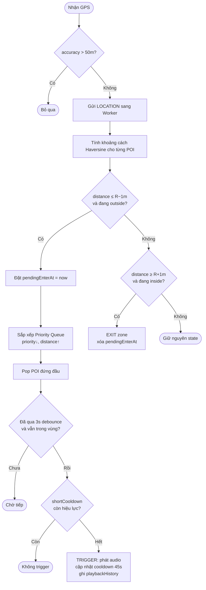
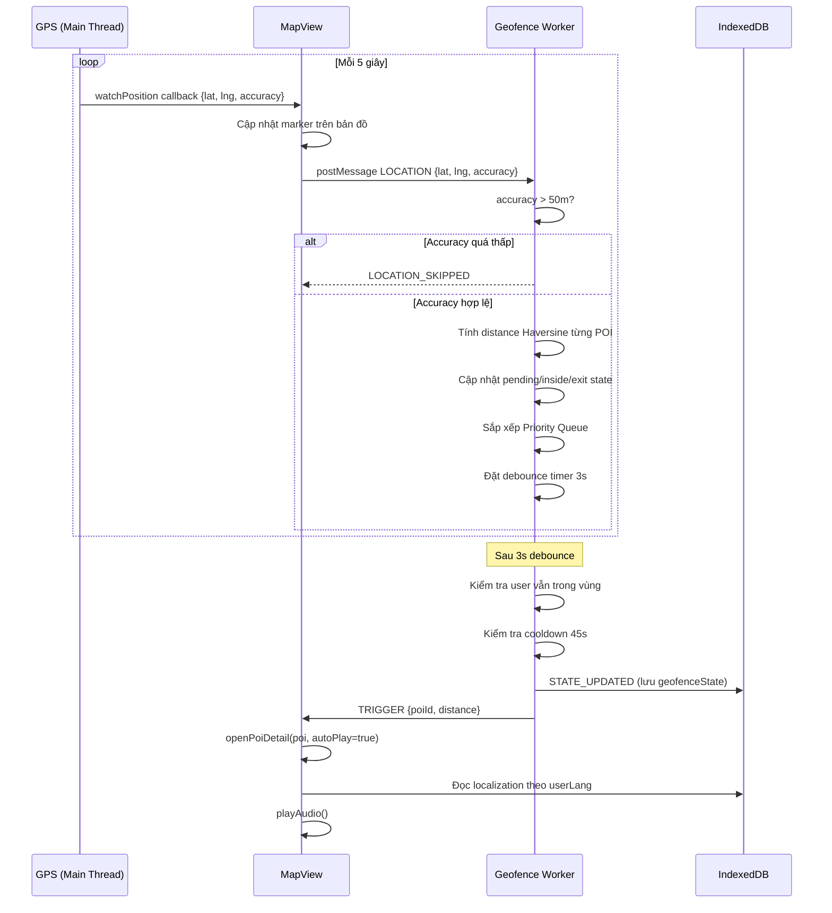
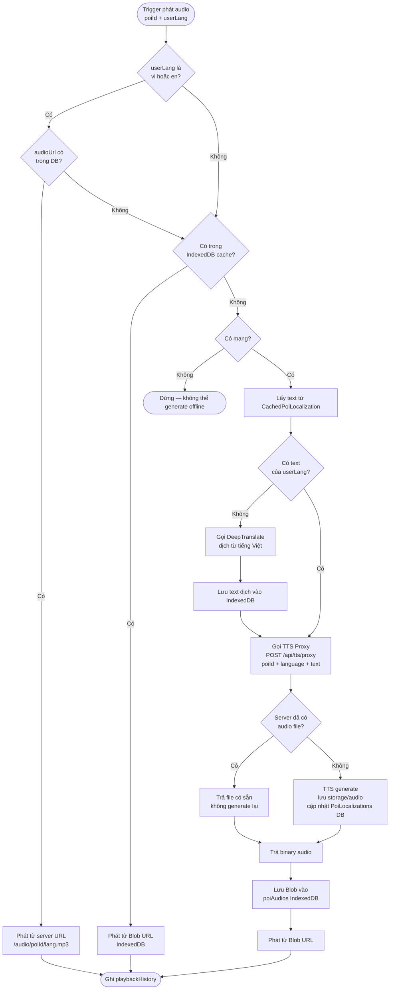
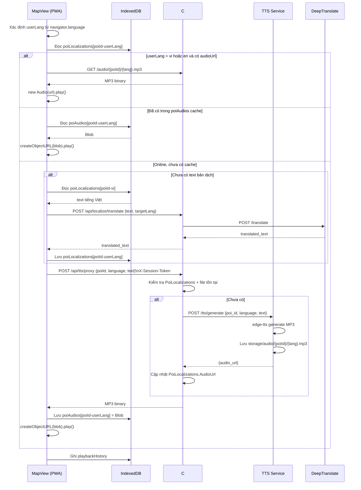
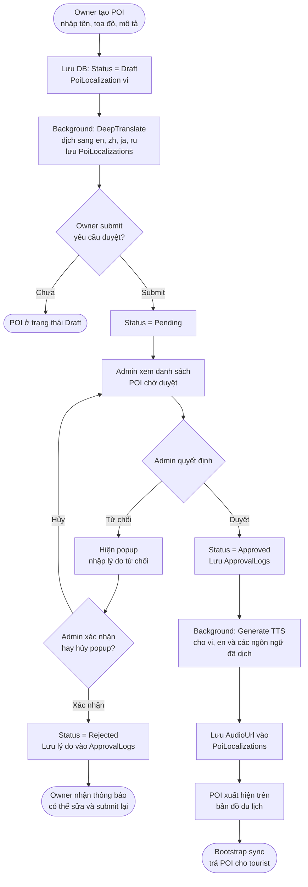
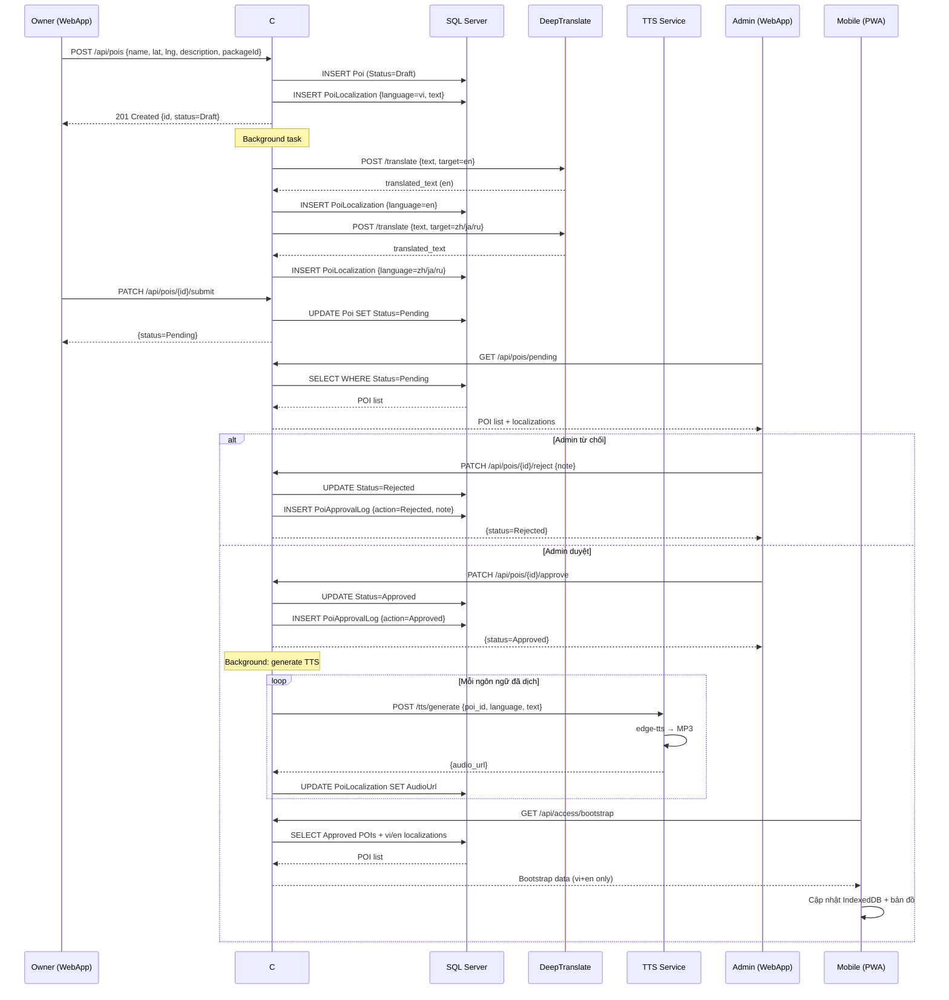

# AudioTravelling — Product Requirements Document

---

## 1. Overview

Hệ thống là một ứng dụng di động hỗ trợ thuyết minh tự động tại phố ẩm thực Vĩnh Khánh (Quận 4), giúp khách du lịch tiếp cận thông tin về các quán ăn thông qua audio theo vị trí GPS.  
Hệ thống sử dụng cơ chế geofence để tự động phát nội dung khi người dùng đi vào vùng của POI.  
Admin và Owner sẽ sử dụng webapp để quản lý.

---

## 2. User Roles

| Role | Mô tả |
|------|-------|
| **User** (khách du lịch) | Quét QR → thanh toán VNPay → truy cập PWA 24h. Không cần đăng nhập tài khoản. |
| **Owner** (chủ quán) | Tạo/sửa/xóa POI, gửi yêu cầu duyệt đến Admin. |
| **Admin** | Quản lý QR, duyệt POI, xem thống kê truy cập theo thời gian thực và lịch sử. |

---

## 3. Scope

- Hệ thống phải quản lý thread và API để nhiều người cùng sử dụng đồng thời.
- Khi user đăng nhập lần đầu sẽ tự động tải toàn bộ tài nguyên cần thiết để dùng offline.
- Mobile app sử dụng **Progressive Web App** (không cần cài từ store).
- Owner/Admin sử dụng **WebApp** riêng.
- Backend: C# ASP.NET Core 8.

### Mobile App
- Theo dõi GPS ở cả foreground và background
- Hiển thị vị trí user và các POI active trên bản đồ
- Tự động phát audio khi vào vùng geofence của POI
- Cho phép user bấm vào POI để xem thông tin và phát audio thủ công
- Hỗ trợ online và offline
- Dùng IndexedDB (Dexie.js) để cache POI, localization, audio

### Geofence & Anti-spam
- Lấy vị trí người dùng mỗi 5 giây
- Tính khoảng cách user–POI
- Trigger theo bán kính R của POI
- Xử lý khi nhiều POI có bán kính trùng nhau (Priority Queue)
- Chống spam: accuracy filter, buffer zone, debounce, short cooldown (45s)

### Audio Thuyết minh
- Mỗi POI có text giới thiệu tiếng Việt
- Tự động detect ngôn ngữ điện thoại
- Phát audio theo ngôn ngữ thiết bị
- Dừng audio cũ khi phát audio mới

### Package
| Gói | Bán kính | Priority |
|-----|----------|----------|
| Cơ bản | 15m | 0 |
| Nâng cao | 30m | 1 |
| Chuyên nghiệp | 50m | 2 |

### Text-to-Speech
- POI gốc lưu tiếng Việt
- Bootstrap chỉ trả về `vi` và `en`
- Các ngôn ngữ khác: generate on-demand qua TTS proxy, lưu server + cache client
- Server lưu audio tại `storage/audio/{poiId}/{language}.mp3`

### Quản lý POI
- Owner tạo POI (Draft) → Submit → Admin duyệt/từ chối
- Chỉ POI Approved mới hiển thị trên map

### Quản lý Truy cập
- Admin xem số người online theo thời gian thực (SignalR)
- Thống kê theo ngày / 3 ngày / tuần / tháng / năm
- Heatmap truy cập

### Quản lý QR
- Admin tạo / bật / tắt / xóa mã QR
- Mã QR nhúng URL → trang thanh toán VNPay

---

## 4. Services

| Service | Công nghệ | Cổng | Mô tả |
|---------|-----------|------|-------|
| **API** | C# ASP.NET Core 8 | 5000 | Backend chính, kết nối DB, xác thực JWT |
| **DeepTranslate** | Python FastAPI + DeepL | 8000 | Dịch text POI sang đa ngôn ngữ |
| **TTS** | Python FastAPI + edge-tts | 8001 | Chuyển text → MP3, lưu file |
| **Mobile** | Next.js 14 PWA | 3000 | Giao diện khách du lịch |
| **WebApp** | Next.js 14 | 3001 | Giao diện Admin/Owner |
| **nginx** | nginx:alpine | 80/443 | Reverse proxy, route `/api/` và `/` |

---

## 5. Database

### Server Database (SQL Server)

| Bảng | Mô tả |
|------|-------|
| `Users` | Admin + Owner |
| `Roles` | Admin / Owner |
| `Packages` | Cơ bản / Nâng cao / Chuyên nghiệp |
| `Pois` | Thông tin POI, trạng thái Draft→Pending→Approved/Rejected |
| `PoiImages` | Ảnh của POI |
| `PoiLocalizations` | Text + AudioUrl theo từng ngôn ngữ |
| `PoiApprovalLogs` | Lịch sử duyệt/từ chối |
| `AccessCodes` | Mã QR do Admin tạo |
| `AccessSessions` | Phiên truy cập 24h sau thanh toán |

### Client Cache (IndexedDB — Dexie.js)

| Store | Mô tả |
|-------|-------|
| `pois` | Metadata POI (id, tọa độ, bán kính, priority) |
| `poiImages` | URL ảnh |
| `poiLocalizations` | Text + audioUrl (chỉ `vi` và `en` từ bootstrap) |
| `poiAudios` | Blob audio cho ngôn ngữ được generate on-demand |
| `geofenceState` | Trạng thái vào/ra zone, cooldown mỗi POI |
| `playbackHistory` | Lịch sử phát audio |

---

## 6. Flow Geofence

### Mô tả các giai đoạn

**Giai đoạn 1 — Nhận GPS**
- App nhận vị trí GPS mỗi 5 giây (main thread)
- Cập nhật vị trí user trên map
- Gửi `{lat, lng, accuracy}` sang Geofence Worker
- Bỏ qua nếu `accuracy > 50m`

**Giai đoạn 2 — Kiểm tra trạng thái vùng**
- Tính khoảng cách user–POI (Haversine)
- Hysteresis buffer 1m:
  - Enter threshold = R − 1m
  - Exit threshold = R + 1m
- Outside + distance ≤ R−1m → đưa vào **pending enter**
- Inside + distance ≥ R+1m → xác nhận **exit zone**

**Giai đoạn 3 — Debounce xác nhận enter**
- Chọn POI ưu tiên cao nhất từ Priority Queue (priority desc, distance asc)
- Chờ **3 giây** để xác nhận vào vùng thật
- Nếu vẫn trong vùng sau debounce → chuyển sang bước 4

**Giai đoạn 4 — Kiểm tra cooldown**
- Kiểm tra `shortCooldownUntil` (45 giây)
- Nếu còn cooldown → không trigger

**Giai đoạn 5 — Trigger audio**
- Set `lastTriggeredAt = now`
- Set `shortCooldownUntil = now + 45s`
- Ghi `playbackHistory`
- Gửi `TRIGGER` về main thread → phát audio

### Activity Diagram — Geofence

### Sequence Diagram — Geofence

---

## 7. Flow Phát Audio Tự Động

### Mô tả

Khi geofence trigger hoặc user bấm "Phát" thủ công, hệ thống xác định ngôn ngữ và chọn nguồn audio phù hợp theo 4 tầng:

- **Tầng 1 (vi/en + audioUrl)**: Phát trực tiếp từ server URL
- **Tầng 2 (IndexedDB cache)**: Phát từ Blob đã cache trên thiết bị
- **Tầng 3 (offline)**: Không thể generate — dừng lại
- **Tầng 4 (online, generate)**: Dịch text → TTS proxy → lưu server + cache client → phát

### Activity Diagram — Phát Audio Tự Động

### Sequence Diagram — Phát Audio Tự Động

---

## 8. Flow Gửi / Duyệt POI

### Mô tả

Owner tạo POI → dịch text background → submit → Admin duyệt/từ chối → nếu approved thì generate TTS và đưa lên map.

### Activity Diagram — Gửi / Duyệt POI

### Sequence Diagram — Gửi / Duyệt POI

---

## 9. Flow DeepTranslate

Gồm 4 tầng:

- **Tầng 1**: Online + ngôn ngữ đã có sẵn trong CachedDB (vi/en từ bootstrap) → phát trực tiếp
- **Tầng 2**: Online + ngôn ngữ chưa có → gọi DeepTranslate → dịch → lưu CachedDB client → generate TTS on-demand
- **Tầng 3**: Offline + ngôn ngữ chưa có → fallback tiếng Anh

---

## 10. Trường hợp POI đè lên nhau

Khi nhiều POI trùng vùng, hệ thống dùng **Priority Queue**:
- Sắp xếp theo `Priority` giảm dần
- Nếu Priority bằng nhau: sắp xếp theo khoảng cách tăng dần
- Chỉ trigger POI đứng đầu queue sau khi debounce pass

---

## 11. Trường hợp nhiều người cùng đứng tại 1 POI

| Rủi ro | Giải pháp |
|--------|-----------|
| TTS generate N lần cùng nội dung | `SemaphoreSlim` per `{poiId}-{language}` — lần đầu generate, lần sau dùng file cũ |
| Rate limit chặn nhầm | Rate limit theo `X-Session-Token` thay vì global |
| Audio chồng nhau | Cooldown 45s + dừng audio cũ trước khi phát mới |

---

## 12. API Endpoints

### Auth
| Method | URL | Mô tả |
|--------|-----|-------|
| POST | `/api/auth/login` | JWT cho Admin/Owner |
| POST | `/api/access/verify` | Kiểm tra session token tourist |

### QR & Thanh toán
| Method | URL | Mô tả |
|--------|-----|-------|
| GET | `/api/qr` | Danh sách QR codes |
| POST | `/api/qr` | Tạo QR mới |
| PATCH | `/api/qr/{id}/toggle` | Bật/tắt QR |
| DELETE | `/api/qr/{id}` | Xóa QR |
| POST | `/api/access/pay` | Tạo VNPay URL từ QR code |
| GET | `/api/access/callback` | VNPay callback → tạo session |
| GET | `/api/access/bootstrap` | Tải POI + audio vi/en (cần session token) |

### POI
| Method | URL | Mô tả |
|--------|-----|-------|
| GET | `/api/pois` | Danh sách POI (Owner: của mình, Admin: tất cả) |
| POST | `/api/pois` | Tạo POI |
| PUT | `/api/pois/{id}` | Cập nhật POI |
| DELETE | `/api/pois/{id}` | Xóa POI + audio files |
| PATCH | `/api/pois/{id}/submit` | Owner submit duyệt |
| GET | `/api/pois/pending` | Danh sách chờ duyệt (Admin) |
| PATCH | `/api/pois/{id}/approve` | Duyệt POI |
| PATCH | `/api/pois/{id}/reject` | Từ chối POI |

### Localization & Audio
| Method | URL | Mô tả |
|--------|-----|-------|
| POST | `/api/pois/{id}/localize` | Trigger dịch + TTS cho 1 POI |
| POST | `/api/admin/audio/bulk` | Bulk generate audio nhiều POI |
| POST | `/api/tts/proxy` | Generate TTS on-demand, lưu server (cần session token) |

### Stats
| Method | URL | Mô tả |
|--------|-----|-------|
| GET | `/api/stats/realtime` | Số session đang active |
| GET | `/api/stats/sessions?period=` | Thống kê theo kỳ |
| GET | `/api/stats/heatmap?period=` | Heatmap truy cập |
| WS | `/hubs/admin` | SignalR — push `OnlineCount` mỗi 30s |