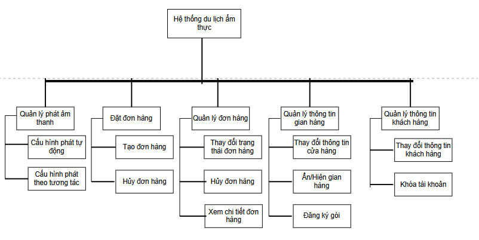
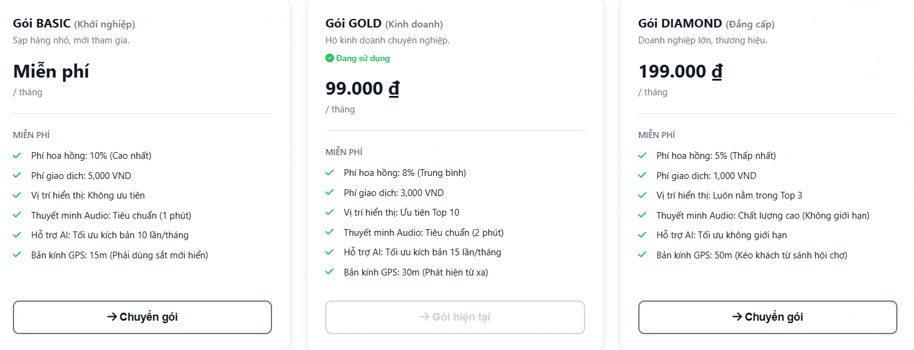
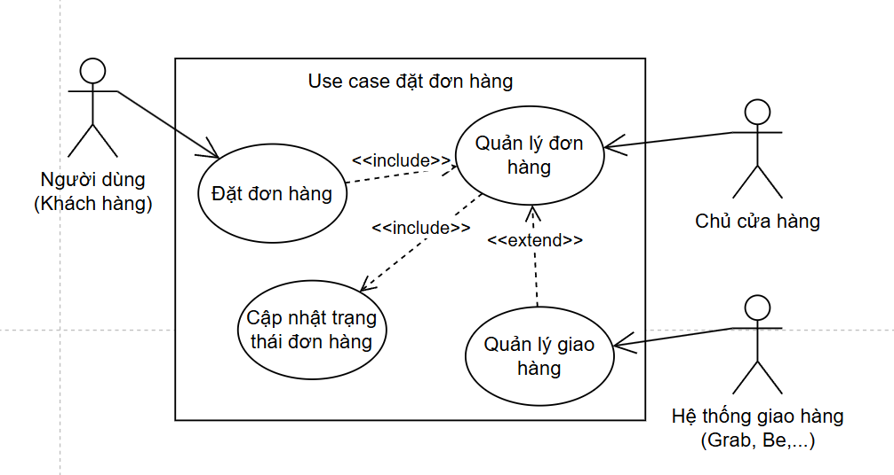
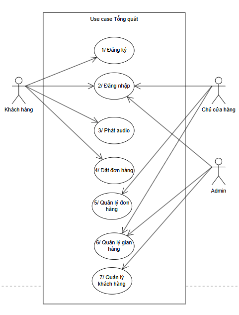
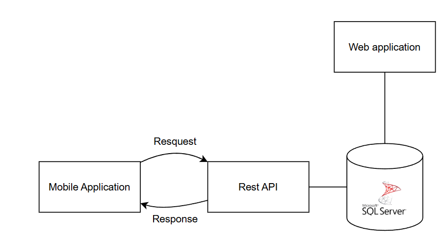
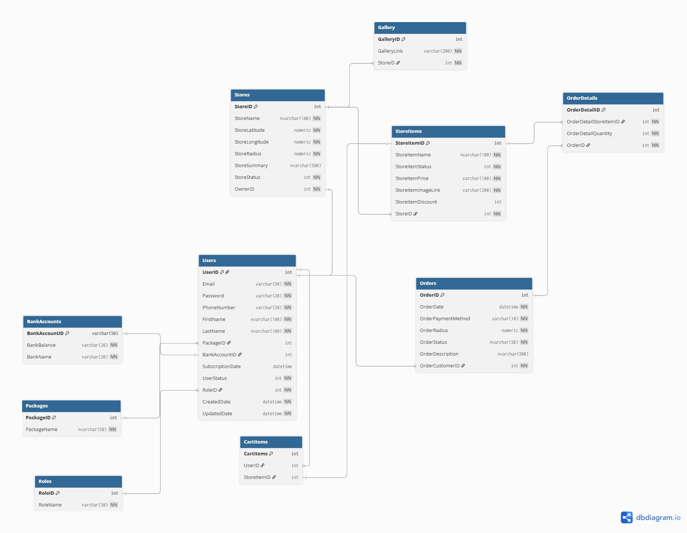

# ĐẶC TẢ YÊU CẦU: ỨNG DỤNG THUYẾT MINH & ĐẶT MÓN PHỐ ẨM THỰC KHÁNH HỘI

## 1. Tổng quan dự án

Xây dựng ứng dụng di động đóng vai trò như một hướng dẫn viên du lịch ảo (Audio Guide) kết hợp nền tảng đặt món trực tuyến dành riêng cho phố ẩm thực Khánh Hội. Hệ thống sẽ tự động phát các đoạn giới thiệu bằng âm thanh dựa trên vị trí thời gian thực của người dùng khi họ di chuyển qua các cửa hàng, đồng thời cho phép tương tác với bản đồ và đặt món ăn.

### 1.1 Lược đồ kiến trúc hệ thống (BFD - Block Flow Diagram)

## 2. Yêu cầu chức năng chi tiết

### 2.1 Quản lý phát âm thanh

* **Cơ chế phát âm thanh:** Âm thanh chỉ được phát nếu người dùng bật chức năng phát audio và cửa hàng có để file Audio trong mục quản lý cửa hàng. Có 2 cách phát audio:
    * Người dùng bước vào bán kính (R) của POI.
    * Người dùng click vào POI trên bản đồ.

* **Thu thập vị trí:** Theo dõi tọa độ GPS của người dùng theo thời gian thực.

* **Delay:** Âm thanh sẽ chỉ được phát sau n giây sau khi người dùng bước vào.

### 2.2 Quản lý Điểm thu hút (POI - Point of Interest)

Mỗi cửa hàng ẩm thực được định nghĩa là một POI độc lập với các thuộc tính:

* **Tọa độ:** Vĩ độ (Latitude) và Kinh độ (Longitude).
* **Bán kính kích hoạt (R):** Vùng không gian địa lý xung quanh cửa hàng.
* **Mức ưu tiên (Priority):** Trọng số để giải quyết xung đột khi người dùng đứng trong vùng giao nhau của nhiều POI.
* **Nội dung giới thiệu:** Đoạn văn bản (text) mô tả cửa hàng do chính chủ quán cung cấp hoặc do AI sinh ra.

**Chức năng quản lý POI** sẽ thay đổi tùy thuộc gói mà chủ của POI mua:

### 2.3 Chức năng đặt món Online

* **Xem món ăn:** Người dùng có thể nhấn vào POI để xem thông tin gian hàng kết hợp với danh sách sách món.

* **Đặt món ăn:**
    * Người dùng chỉ có thể đưa các món ăn trong cùng 1 cửa hàng vào giỏ hàng.
    * Chủ cửa hàng sẽ xác nhận món ăn và tự dùng các ứng dụng giao hàng để giao hàng.
    * Người dùng sau khi giao hàng sẽ ấn xác nhận để hoàn thành đơn hàng.

### 2.4 Website dành cho Chủ cửa hàng và Admin

* **Quản lý gian hàng (POI):**
    * **Chủ cửa hàng:** Thực hiện các thao tác CRUD (Tạo, Đọc, Cập nhật, Xóa) cho hồ sơ cửa hàng, tọa độ, bán kính và nội dung văn bản.
    * **Admin:** Xem danh sách của toàn bộ các gian hàng có trong hệ thống. Được phép thực hiện các thao tác CRUD (Tạo, Đọc, Cập nhật, Xóa) cho hồ sơ cửa hàng, tọa độ, bán kính và nội dung văn bản.

* **Quản lý đơn hàng:**
    * **Chủ cửa hàng:** Cho phép thay đổi trạng thái đơn hàng và tra cứu thông tin đơn hàng.

* **Quản lý khách hàng:**
    * **Admin:** Cho phép khóa/mở tài khoản. Thực hiện các thao tác CRUD cho hồ sơ khách hàng.

## 3. Data Pipeline

